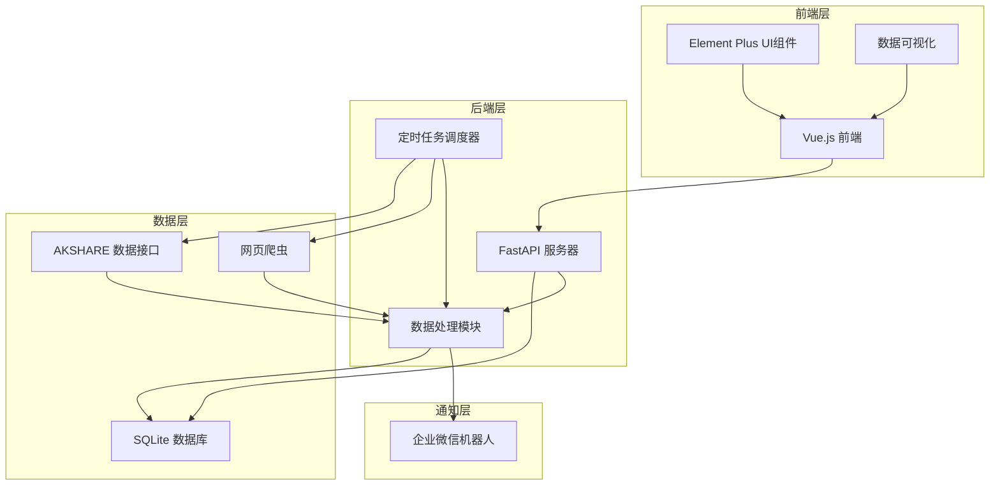

# 架构设计文档：货币基金套利提示系统

## 1. 技术选型

| 类别 | 技术/工具 | 版本 | 选型理由 |
|------|----------|------|---------|
| 前端 | Vue.js 3 | 3.x | 轻量级前端框架，响应式设计，适合构建数据展示界面 |
| 前端构建工具 | Vite | 4.x | 快速的开发服务器和构建工具，提供良好的开发体验 |
| UI组件库 | Element Plus | 2.x | 功能丰富的UI组件，易于使用，适合构建管理界面 |
| 后端 | Python | 3.9+ | 易于编写数据采集和处理脚本，生态丰富 |
| 后端框架 | FastAPI | 0.95+ | 高性能异步框架，自动生成API文档，适合构建RESTful API |
| 数据存储 | SQLite | 3.35+ | 轻量级嵌入式数据库，无需额外配置，适合本地部署 |
| 数据采集 | AKSHARE | 0.9.70+ | 免费开源的金融数据接口库，提供股票和基金数据 |
| 网页爬虫 | BeautifulSoup4 | 4.11+ | 轻量级HTML解析库，用于从天天基金网爬取净值数据 |
| 定时任务 | APScheduler | 3.10+ | 强大的Python定时任务库，支持多种调度方式 |
| 通知服务 | 企业微信机器人 | - | 免费的企业级通知工具，适合发送套利提醒 |

## 2. 系统设计

### 2.1 架构图



### 2.2 模块划分

| 模块 | 功能描述 | 主要职责 |
|------|---------|---------|
| 前端模块 | 数据展示和用户界面 | 展示实时收益率数据、历史趋势图表、套利提醒记录 |
| 后端API模块 | 提供数据接口 | 处理前端请求，返回数据 |
| 数据采集模块 | 定时采集市场数据 | 从AKSHARE获取价格数据，从天天基金网爬取净值数据 |
| 数据处理模块 | 计算收益率和判断套利机会 | 计算年化收益率，判断是否达到提醒阈值 |
| 数据存储模块 | 存储历史数据 | 管理SQLite数据库，存储价格、净值、收益率和提醒记录 |
| 通知模块 | 发送套利提醒 | 通过企业微信机器人发送提醒消息 |

### 2.3 接口规范

| 接口路径 | 方法 | 功能描述 | 请求参数 | 响应格式 |
|---------|------|---------|---------|---------|
| `/api/funds` | GET | 获取基金列表 | 无 | `[{"code": "511880", "name": "银华日利"}, {"code": "511990", "name": "华宝添益"}]` |
| `/api/prices` | GET | 获取价格数据 | `fund_code`(可选), `start_time`(可选), `end_time`(可选) | `[{"fund_code": "511880", "timestamp": "2023-06-01 10:00:00", "bid_price": 100.01, "ask_price": 100.02}]` |
| `/api/nav` | GET | 获取净值数据 | `fund_code`(可选), `date`(可选) | `[{"fund_code": "511880", "date": "2023-06-01", "nav": 100.05}]` |
| `/api/yield` | GET | 获取收益率数据 | `fund_code`(可选), `start_time`(可选), `end_time`(可选) | `[{"fund_code": "511880", "timestamp": "2023-06-01 10:00:00", "bid_yield": 1.6, "ask_yield": 1.5}]` |
| `/api/alerts` | GET | 获取提醒记录 | `fund_code`(可选), `start_time`(可选), `end_time`(可选) | `[{"timestamp": "2023-06-01 10:00:00", "fund_code": "511880", "yield": 1.6, "content": "银华日利买入赎回年化收益率达到1.6%"}]` |
| `/api/errors` | GET | 获取错误记录 | `start_time`(可选), `end_time`(可选) | `[{"timestamp": "2023-06-01 10:00:00", "error_type": "数据采集失败", "error_message": "无法获取价格数据"}]` |

### 2.4 数据流

1. **数据采集流程**：
   - 定时任务调度器每5分钟触发一次价格数据采集
   - 定时任务调度器每天触发一次净值数据采集
   - 数据采集模块从AKSHARE获取价格数据，从天天基金网爬取净值数据
   - 采集的数据存储到SQLite数据库

2. **数据处理流程**：
   - 数据处理模块从数据库读取价格和净值数据
   - 计算买入赎回年化收益率（基于买一价格和卖一价格）
   - 判断是否达到提醒阈值（年化收益率≥1.5%）
   - 达到阈值时，通过企业微信机器人发送提醒
   - 处理结果存储到数据库

3. **数据展示流程**：
   - 前端通过API获取实时数据和历史数据
   - 展示收益率数据和价格数据
   - 展示历史趋势图表
   - 展示提醒记录

## 3. 数据模型

### 3.1 数据库表结构

#### 3.1.1 基金信息表（funds）
| 字段名 | 数据类型 | 约束 | 描述 |
|-------|---------|------|------|
| id | INTEGER | PRIMARY KEY AUTOINCREMENT | 主键 |
| code | TEXT | UNIQUE NOT NULL | 基金代码 |
| name | TEXT | NOT NULL | 基金名称 |
| create_time | TIMESTAMP | DEFAULT CURRENT_TIMESTAMP | 创建时间 |

#### 3.1.2 价格数据表（prices）
| 字段名 | 数据类型 | 约束 | 描述 |
|-------|---------|------|------|
| id | INTEGER | PRIMARY KEY AUTOINCREMENT | 主键 |
| fund_code | TEXT | NOT NULL | 基金代码 |
| timestamp | TIMESTAMP | NOT NULL | 时间戳 |
| bid_price | REAL | NOT NULL | 买一价格 |
| ask_price | REAL | NOT NULL | 卖一价格 |
| create_time | TIMESTAMP | DEFAULT CURRENT_TIMESTAMP | 创建时间 |
| INDEX | (fund_code, timestamp) | - | 基金代码和时间戳索引 |

#### 3.1.3 净值数据表（navs）
| 字段名 | 数据类型 | 约束 | 描述 |
|-------|---------|------|------|
| id | INTEGER | PRIMARY KEY AUTOINCREMENT | 主键 |
| fund_code | TEXT | NOT NULL | 基金代码 |
| date | DATE | NOT NULL | 日期 |
| nav | REAL | NOT NULL | 净值 |
| create_time | TIMESTAMP | DEFAULT CURRENT_TIMESTAMP | 创建时间 |
| INDEX | (fund_code, date) | - | 基金代码和日期索引 |

#### 3.1.4 收益率数据表（yields）
| 字段名 | 数据类型 | 约束 | 描述 |
|-------|---------|------|------|
| id | INTEGER | PRIMARY KEY AUTOINCREMENT | 主键 |
| fund_code | TEXT | NOT NULL | 基金代码 |
| timestamp | TIMESTAMP | NOT NULL | 时间戳 |
| bid_yield | REAL | NOT NULL | 买一价格年化收益率 |
| ask_yield | REAL | NOT NULL | 卖一价格年化收益率 |
| create_time | TIMESTAMP | DEFAULT CURRENT_TIMESTAMP | 创建时间 |
| INDEX | (fund_code, timestamp) | - | 基金代码和时间戳索引 |

#### 3.1.5 提醒记录表（alerts）
| 字段名 | 数据类型 | 约束 | 描述 |
|-------|---------|------|------|
| id | INTEGER | PRIMARY KEY AUTOINCREMENT | 主键 |
| timestamp | TIMESTAMP | NOT NULL | 时间戳 |
| fund_code | TEXT | NOT NULL | 基金代码 |
| yield_rate | REAL | NOT NULL | 年化收益率 |
| content | TEXT | NOT NULL | 提醒内容 |
| create_time | TIMESTAMP | DEFAULT CURRENT_TIMESTAMP | 创建时间 |
| INDEX | (fund_code, timestamp) | - | 基金代码和时间戳索引 |

#### 3.1.6 错误记录表（errors）
| 字段名 | 数据类型 | 约束 | 描述 |
|-------|---------|------|------|
| id | INTEGER | PRIMARY KEY AUTOINCREMENT | 主键 |
| timestamp | TIMESTAMP | NOT NULL | 时间戳 |
| error_type | TEXT | NOT NULL | 错误类型 |
| error_message | TEXT | NOT NULL | 错误信息 |
| create_time | TIMESTAMP | DEFAULT CURRENT_TIMESTAMP | 创建时间 |
| INDEX | (timestamp) | - | 时间戳索引 |

### 3.2 API请求/响应格式

#### 3.2.1 获取基金列表
- 请求：GET /api/funds
- 响应：
  ```json
  [
    {"code": "511880", "name": "银华日利"},
    {"code": "511990", "name": "华宝添益"}
  ]
  ```

#### 3.2.2 获取价格数据
- 请求：GET /api/prices?fund_code=511880&start_time=2023-06-01T00:00:00&end_time=2023-06-01T23:59:59
- 响应：
  ```json
  [
    {
      "fund_code": "511880",
      "timestamp": "2023-06-01T10:00:00",
      "bid_price": 100.01,
      "ask_price": 100.02
    }
  ]
  ```

#### 3.2.3 获取净值数据
- 请求：GET /api/nav?fund_code=511880&date=2023-06-01
- 响应：
  ```json
  [
    {
      "fund_code": "511880",
      "date": "2023-06-01",
      "nav": 100.05
    }
  ]
  ```

#### 3.2.4 获取收益率数据
- 请求：GET /api/yield?fund_code=511880&start_time=2023-06-01T00:00:00&end_time=2023-06-01T23:59:59
- 响应：
  ```json
  [
    {
      "fund_code": "511880",
      "timestamp": "2023-06-01T10:00:00",
      "bid_yield": 1.6,
      "ask_yield": 1.5
    }
  ]
  ```

#### 3.2.5 获取提醒记录
- 请求：GET /api/alerts?fund_code=511880&start_time=2023-06-01T00:00:00&end_time=2023-06-01T23:59:59
- 响应：
  ```json
  [
    {
      "timestamp": "2023-06-01T10:00:00",
      "fund_code": "511880",
      "yield": 1.6,
      "content": "银华日利买入赎回年化收益率达到1.6%"
    }
  ]
  ```

#### 3.2.6 获取错误记录
- 请求：GET /api/errors?start_time=2023-06-01T00:00:00&end_time=2023-06-01T23:59:59
- 响应：
  ```json
  [
    {
      "timestamp": "2023-06-01T10:00:00",
      "error_type": "数据采集失败",
      "error_message": "无法获取价格数据"
    }
  ]
  ```

## 4. 设计约束

### 4.1 性能约束
- 数据采集频率：价格数据每5分钟一次，净值数据每天一次
- 数据存储周期：历史数据存储5天
- 前端响应时间：API响应时间不超过1秒
- 后端处理能力：能够处理并发请求，支持至少10个同时在线用户

### 4.2 安全约束
- 敏感信息管理：企业微信机器人webhook地址存储在环境变量中，不硬编码
- 数据验证：对所有输入参数进行验证，防止恶意输入
- 错误处理：对数据采集和处理过程中的错误进行捕获和记录，不暴露敏感信息给用户

### 4.3 可靠性约束
- 数据采集容错：当数据采集失败时，记录错误并尝试重新采集
- 系统稳定性：确保定时任务稳定运行，即使在网络不稳定的情况下
- 数据一致性：确保价格数据和净值数据的一致性，避免计算错误

### 4.4 可维护性约束
- 代码结构清晰：遵循模块化设计，代码结构清晰易读
- 文档完整：提供详细的系统设计文档和API文档
- 日志记录：记录系统运行状态和错误信息，便于问题排查

### 4.5 扩展性约束
- 模块化设计：采用模块化设计，便于后续添加新功能
- 配置化管理：关键参数通过配置文件管理，便于调整
- 接口规范：遵循RESTful API规范，便于与其他系统集成

## 5. 部署与集成方案

### 5.1 部署方式
- 本地部署：在用户本地机器上运行
- 前端部署：使用Vite构建，生成静态文件
- 后端部署：使用Python直接运行FastAPI应用

### 5.2 集成方案
- 前端与后端集成：通过API接口进行数据交互
- 数据采集与存储集成：定时任务采集数据并存储到SQLite数据库
- 通知服务集成：通过企业微信机器人API发送提醒

### 5.3 启动流程
1. 初始化数据库：创建数据库表结构
2. 启动后端服务：运行FastAPI应用
3. 启动定时任务：开始数据采集
4. 启动前端服务：运行Vue.js应用
5. 配置企业微信机器人：设置webhook地址

## 6. 监控与维护

### 6.1 监控指标
- 数据采集成功率：监控价格和净值数据的采集成功率
- 系统运行状态：监控后端服务和定时任务的运行状态
- 提醒触发次数：监控套利提醒的触发次数
- 错误发生频率：监控系统错误的发生频率

### 6.2 维护方案
- 定期清理历史数据：每5天清理一次过期数据
- 检查系统运行状态：定期检查系统运行状态，确保正常运行
- 更新数据采集接口：当数据来源API变更时，及时更新采集代码
- 优化系统性能：根据实际运行情况，优化系统性能

## 7. 总结

本架构设计文档详细描述了货币基金套利提示系统的技术选型、系统设计、数据模型和设计约束。系统采用前后端分离架构，使用Vue.js 3作为前端框架，FastAPI作为后端框架，SQLite作为数据存储，实现了对银华日利和华宝添益两支货币基金的监控和套利提醒功能。

系统设计考虑了性能、安全、可靠性和可维护性等因素，确保系统能够稳定运行并满足用户需求。同时，系统采用模块化设计，便于后续扩展和维护。

该设计方案符合项目整体架构规范，使用了全免费的技术栈，适合本地部署，能够满足用户对货币基金套利机会的监控需求。